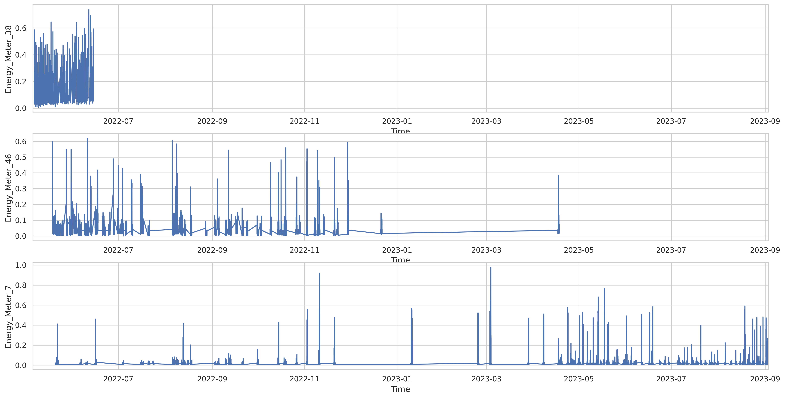
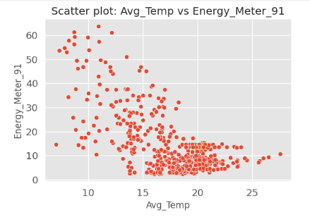
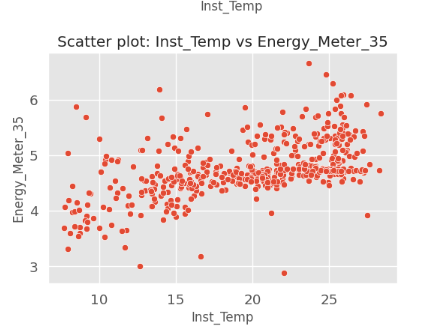
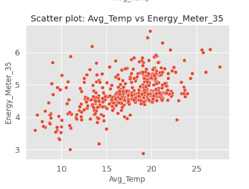
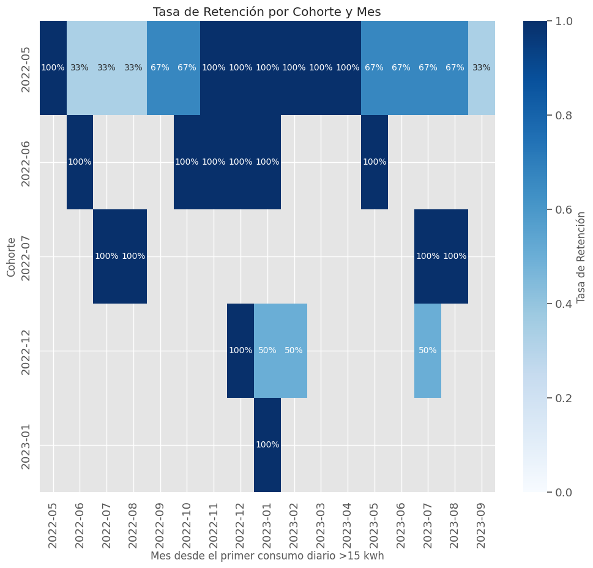
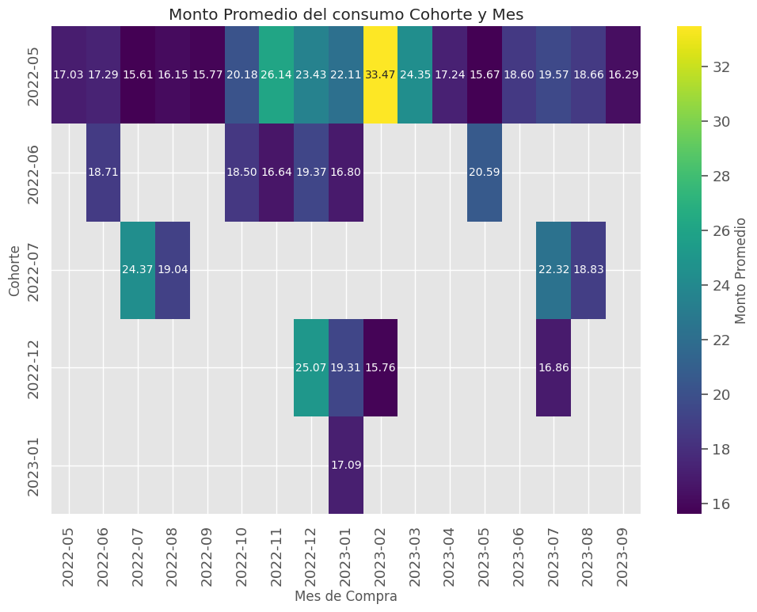
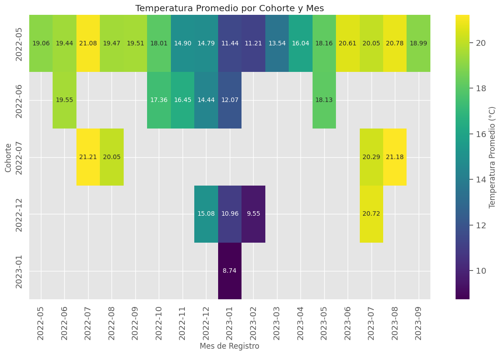

## Proyecto 3  Curso Data Scientist  UOC 2024 
https://github.com/users/pugasoca/projects/1

**Descripipción:** Consumo Energía Eléctricade cooperativa energética.

**Autor:** José Puga Socarrás
- linkedin: https://www.linkedin.com/in/jose-puga-socarras-89677111
- Correo : jpugas@uoc.edu
  
**Consultor Técnico Temas Energéticos:** Ingeniero Eléctrico Alejandro Sanchez Venereo
  
https://www.linkedin.com/in/alejandro-sanchez-venereo-35069833/

**Dataset Donwload:**

https://www.sciencedirect.com/science/article/pii/S2352340924003421

**Artículo de datos:**

https://data.mendeley.com/datasets/vryvyfz2tj/1

**Autores de los datos y su artículo:**

Francisco Monteiro, Rafael Oliveira, Juan Almeida, Pedro Gonçalves, Paulo Bartolomeu,Jorge Neto y Ricardo Dios 
Licencia Creative Commons: 
Este es un artículo de acceso abierto distribuido bajo los términos de la licencia Creative Commons CC-BY , que permite el uso, la distribución y la reproducción sin restricciones en cualquier medio, siempre que se cite correctamente la obra original.

**Contexto:**

Las comunidades energéticas son figuras jurídicas que permiten que los ciudadanos produzcan, consuman, almacenen, compartan y vendan energía renovable colectivamente.
Su finalidad principal es proporcionar beneficios ambientales, económicos y sociales a sus miembros y al entorno en el que desarrollan su actividad, más que una rentabilidad financiera.
El conjunto de datos contiene información sobre el consumo eléctrico y datos meteorológicos recopilados de 172 edificios residenciales pertenecientes a una cooperativa energética local. Ubicación:	Loureiro, Oliveira de Azeméis, Portugal.

**Objetivos**
- Caracterizar el perfil de consumo de energía eléctrica de los habitantes de la región y correlacionar los hábitos de consumo en función de las condiciones climáticas, como la temperatura, la luz o la humedad, 
- Ayudar a comprender los comportamientos y las tendencias de consumo. También pueden ser utilizados por los consumidores al tomar decisiones relacionadas con la compra/venta/almacenamiento de energía, teniendo en cuenta las perspectivas de consumo futuras y las condiciones meteorológicas.
- Analizar el coportamiento de los  medidores inteligentes PLC. Funcionamiento o no.
- Construcción de modelos de aprendizaje, capaces de predecir el consumo futuro y modelos que pueden mejorarse al aprender el impacto causado por las condiciones ambientales relacionadas.
- Personal: Aplicar los conociemientos apendidos durante el curso.

 # Análisis de Calidad de los Datos
  
- loureiro_energy.csv:
   El conjunto de datos incluye mediciones de consumo de energía de 172 edificios de una cooperativa Energetica, recopiladas cada 15 minutos mediante medidores inteligentes PLC entre el 05/05/2022 y el 02/09/2023. Consta de 46,608 filas, organizadas por fecha y hora, y presenta columnas para cada edificio, además de una columna de tiempo .  A algunos edificios les faltan entradas, que están marcadas como (NaN).
  

Columna 
Time: fecha y hora ejemplo:  2023-01-03 05:52:30  
Energy_Meter_1 ...  Energy_Meter_172: KWHora ejemplo= 0.058
- weather_aveiro_final.csv:
  Datos meteorológicos locales. Tomados de una estación cercana en Aveiro, complementan las mediciones energéticas, coincidiendo en tiempo y número de registros; fueron recopilados originalmente en intervalos de 10 minutos. Para coincidir con los intervalos de 15 minutos de los datos de consumo de energía, se remuestrearon promediando los minutos 10 y 20 para asignarlos al intervalo de 15 minutos, y los minutos 40 y 50 para el intervalo de 45 minutos, manteniendo los valores de los minutos 0 y 30.

Para comprender mejor la estructura de datos, a continuación se presenta una explicación detallada de cada columna:

- **“Hora”**: fecha y hora de la medición registrada.
- **“Energy_Meter_x”**: consumo de energía en intervalos de 15 minutos (kWh) del medidor con ID x.
- **“Avg_Temp”**: temperatura media del aire a 1,5 m sobre el suelo, presentada en grados Celsius (°C).
- **“Avg_Rel_Humidity”**: la humedad relativa promedio en porcentaje.
- **“Avg_Wind_Direction”**: dirección del viento, de 0 a 360°.
- **“Avg_Wind_Speed”**: velocidad del viento en m/s.
- **“Max_Inst_Wind_Speed”**: velocidad máxima instantánea del viento, también en m/s.
- **“Inst_Temp”**: temperatura instantánea del aire a 1,5 m, en grados Celsius (°C).
- **“Quantity_Precip”**: cantidad de precipitación en milímetros.
- **“Max_Inst_Precip”**: intensidad máxima de precipitación instantánea en mm/h.
- **“Total_Global_Rad”**: radiación global total, medida en KJ/m².

Como se puede observar no existen valores duplicados en ninguno de los dos Dataset

#### Se verifica que están todo el rango de valores de fecha . Para hacerlo contamos cuantos observaciones de fecha existen entre el minimo y el maximo y debe ser igual a la cantidad de observaciones 46608, creamos una serie de fechas basada en los parámetros que especificaste (start, end, freq). Tabién verificamos que los rangos son iguales a los rangos de las dos dataset 

 ## Identificando problemas como valores faltantes por dispositivos e interpretación de mediciones con valores cero 
 

 
 
 
 ### Energy Meters con el porciento de valores faltantes con más del 75% de valores nulos:
 
 ['Energy_Meter_38', 'Energy_Meter_46', 'Energy_Meter_7']

 
### Energy Meters con más de 34,956/46,608 es decir más el 75 %  valores cero:

['Energy_Meter_122', 'Energy_Meter_102', 'Energy_Meter_21', 'Energy_Meter_121', 'Energy_Meter_156', 'Energy_Meter_68', 'Energy_Meter_57', 'Energy_Meter_83', 'Energy_Meter_133', 'Energy_Meter_72', 'Energy_Meter_113', 'Energy_Meter_144', 'Energy_Meter_137', 'Energy_Meter_140']

## Datos meteorológicos locales : está practicamnete todos los datos del total de 46608 
| Column Name | Count |
|---|---|
| Avg_Rel_Humidity | 46602 |
| Avg_Wind_Direction | 46608 |
| Avg_Wind_Speed | 46608 |
| Max_Inst_Wind_Speed | 46608 |
| Inst_Temp | 46603 |
| Quantity_Precip | 46608 |
| Max_Inst_Precip | 46608 |
| Total_Global_Rad | 46603 |

| Column Name | Count of Null Values |
|---|---|
| Avg_Temp | 6 |
| Avg_Rel_Humidity | 6 |
| Avg_Wind_Direction | 0 |
| Avg_Wind_Speed | 0 |
| Max_Inst_Wind_Speed | 0 |
| Inst_Temp | 5 |
| Quantity_Precip | 0 |
| Max_Inst_Precip | 0 |
| Total_Global_Rad | 5 |

### Todos los valores en 'Avg_Wind_Direction' están dentro del rango de 0 a 360 grados.
### No se encontraron valores fuera del rango de 0 a 100 en 'Avg_Rel_Humidity'.

Esta falta de datos y valores con ceros puede ser causada por muchos motivos: 

1.	**Falta de Consumo o Demanda:** Si no hay consumo de energía en el momento en que se realiza la medición, el PLC podría registrar un valor de cero. Por ejemplo, si un dispositivo o sistema que está siendo monitoreado está apagado o en reposo, el consumo de energía podría ser cero.
2.	Interrupciones o Fallos en la Comunicación: Si el PLC pierde la comunicación con el medidor de energía o con algún dispositivo asociado, es posible que registre un valor de cero debido a un fallo de comunicación o un error de lectura temporal.
3.	Error de Configuración: Un error de configuración en el PLC o en el sistema de adquisición de datos puede causar que los valores se registren como cero, si hay un problema con el mapeo de las direcciones de memoria, configuraciones incorrectas o una mala calibración del medidor de energía.
4.	**Mediciones en el Intervalo de 0**: En sistemas que toman lecturas en intervalos pequeños (como cada 15 minutos), podría ocurrir que en ciertos momentos el consumo de energía se registre como cero si no se consume energía en ese intervalo exacto.
5.	Condiciones Específicas de Medición: En algunos sistemas, el medidor de energía puede estar configurado para registrar un valor de cero durante ciertos períodos de inactividad, como cuando no se detecta flujo de energía o cuando los dispositivos monitoreados están apagados temporalmente.
6.	Reset o Inicialización del Sistema: Si el PLC o el colector de datos se reinicia o se restablece, puede haber momentos en los que los valores se inician en cero hasta que se obtengan nuevas mediciones

**Conclusión:**

De el mapa de calor de valores nulos de data_energy obsevamos varios dispositivos con gran cantidad de valores nulos, y algunos intervalos de tiempo todos los dispositivos tienen valores nulos.
Concluimos que la presencia de valores nulos y ceros en los datos es un comportamiento relativamente común en el sector de la energía en relación con la recopilacion de datos en exteriores por los motivios expuestos . 

En nuestro estudio, hay un 25% de valores nulos no debería influir de manera significativa en los resultados, pero para este estudio , y desde un ponto de vista técnico imputaremos los valores nulos 
con alguna de las tecnicas aprendidas durante el curso, con las mediciones en ceros en nuetro proyecto en partícular tomamos la decicion de darlos por buenos, recomendamos un estudio posterior imputando valores a los ceros. 

# No no obstante nos enfocaremos en el proyecto en los 10 dispositivos con mayor cantidad de datos y menos valores nulos siendo estos imputados por algún metodo de los aprendidos en el curso  

**Recomendación:**

Recomendamos realizar el mismo análisis exclusivamente con los PLC (Controladores Lógicos Programables) que hayan recopilado la mayor cantidad de datos. Alternativamente, se considerara la imputación de valores nulos. Esto permitiría mejorar la capacidad para entrenar modelos más precisos y confiables, reduciendo el riesgo de introducir sesgos derivados de la eliminación de datos. De esta manera, el modelo podría basarse en datos más completos y representativos, mejorando la calidad de las predicciones y análisis.

### 

# Análisis Exploratorio de Datos (EDA)

**Explicación para entender los datos sobre el consumo Energia**

## Consumo Típico Promedio en una Casa Estándar

**Hogar Promedio en  Europa:**

- **Consumo diario promedio:** 20-30 kWh (kilovatios hora).

## En 15 minutos, esto equivale a:

$$
\frac{20 \, \text{kWh}}{24 \, \text{horas}} \times  \frac{1}{4} \approx 0.208 \, \text{kWh} \, (208 \, \text{Wh})
$$

Lo que sería **200-250 Wh** cada 15 minutos en promedio.

## Hogar con Uso Intensivo de Energía (uso de aire acondicionado, calefacción, electrodomésticos grandes):

- **Consumo diario promedio:** 30-50 kWh.

### En 15 minutos:

$$
\frac{30 \, \text{kWh}}{24 \, \text{horas}} \times \frac{1}{4} \approx 0.3125 \, \text{kWh} \, (312.5 \, \text{Wh})
$$

Lo que sería **300-400 Wh** cada 15 minutos.

## Hogar Eficiente Energéticamente (uso de paneles solares, electrodomésticos eficientes, etc.):

- **Consumo diario promedio:** 10-15 kWh.

### En 15 minutos:

$$
\frac{10 \, \text{kWh}}{24 \, \text{horas}} \times  \frac{1}{4} \approx 0.104 \, \text{kWh} \, (104 \, \text{Wh})
$$

Lo que sería **100-150 Wh** cada 15 minutos.

## Factores que Afectan el Consumo:

### Uso de Electrodomésticos:

- **Refrigerador:** ~30-50 Wh cada 15 minutos.
- **Aire acondicionado:** ~300-1,000 Wh cada 15 minutos.
- **Televisión:** ~50-75 Wh cada 15 minutos.
- **Portátil:** ~10-20 Wh cada 15 minutos.

### Horarios Pico:

En las mañanas y tardes, el consumo suele ser más alto debido al uso de electrodomésticos como lavadoras, secadoras y equipos de cocina.

### Condiciones de las vivienda ( materiales aislantes,ventanas,etc)
### Condicones  meteorológica ( Temperatura, viento, incidencia del sol, lluvias ) Están serán motivo de estudios del presente proyecto 

## Analisis del comportamiento de los dispositivos 

Top 3 dispositvos con mayor faltante de datos, debido a cualquier de las razones anteriores pero con en el tiempo vemos algunos siguen funcionando.

Top 5 Dispositvos con mayor cantiadad de datos

Del top 5 de dispositivos vemos que hay un período que ninguno registró valores.

### Alanalizamos cuando o no los dispositivos funcionaron 

Observamos que existen algunos momentos específicos en los que ninguno de los dispositivos operó, así como un período significativo entre julio de 2023 y septiembre de 2023 en el que se evidenció una gran fluctuación en su funcionamiento.

Hemos segmentado este período para realizar un análisis más detallado, ya que consideramos que este comportamiento anómalo debe ser discutido con los técnicos responsables. No obstante, trataremos este período como un outlier en nuestro análisis principal, pero lo incluiremos en el estudio para garantizar una visión más integral de los datos.

Hacemos el Merge entre los dos dataset de valores de PlC y datos meteorológicos y nos quedamos con las mediciones de os 10 PLC (Energy_Meter) con menos valores nulos y con mas valores mayores que cero 

## Mapa de los calor de nuevo dataset 

## Distribución de Tipos de Valores en new_dataset 

# Tratamiento de los valores nulos 

- para las columnas con valores meteorologicos utilizamos directamente KNN vecinos por tener pocos valores faltantes, las variables tienen patrones y relaciones claras con otras variables (es decir,  
  hay un comportamiento similar entre las filas con valores faltantes y sus vecinos más cercanos), 
- para las columnas con valores de consumo hemos comprobado si existe una fuerte relación lineal entre las variables y un analisis de residuos para ver si es valida la imputación por regresion lineal 
  debido a la gran cantidad de datos y ahorrarnos el coste computacional de  (KNN) . La imputación por regresión implica predecir los valores faltantes en una variable utilizando una regresión de esa 
  variable sobre otras variables que no tienen valores faltantes, no es el caso poque todas las columnas de energia tienen valores faltantes, por lo que investigaremos si hay una 
  correlaciones significativas entre las variables meteorológicas y las columnas de consumo de energía (por ejemplo, una correlación de 0.7 o superior). No observamos relaciones significativas entre
  las variables de consumo y las meteorologicas para poder usar la imputación por regresion lineal. 

No obteniendo ninguna correlacion siginifivativa entre los valores de consumo, ni entre ellos y las varaiables meteorologicas , decidimos tambien imputar los valores nulos de consumo usando metodos basado en KNN pero antes hacemos el escalado de los datos para garantizar que los valores imputados sean consistentes y reflejen patrones reales en las variables.

## Matriz correlacion 

### Se observa que los consumos mensuales de energía presentan un patrón previsible, aumentando durante los meses de verano e invierno, lo que coincide con las variaciones de temperatura características de estas estaciones. Además, se destaca que durante el invierno se registra un incremento en la velocidad del viento, mientras que, a pesar de este fenómeno, el consumo de energía se mantiene elevado.

### En base a estos hallazgos, se recomienda a la comunidad energética considerar la implementación de aerogeneradores, siempre que sea viable económicamente, para aprovechar las condiciones de viento durante estas temporadas. De esta manera, se podría optimizar el uso de energía limpia, contribuyendo tanto al bienestar económico como al ambiental.

## Consumos Mensuales 

### En el análisis de Energy_Meter_90, se observa un comportamiento de consumo excesivo y continuo durante los meses de verano. Sin embargo, en invierno, el consumo se mantiene considerablemente bajo. Además, se destaca un apagón (blackout) en los medidores de energía, específicamente al final de junio de 2023, lo que sugiere una posible interrupción en el suministro o un fallo en el sistema de medición.

## Detectar valores atípicos e insights relevantes.

 

 

# Análisis de Gráficos y Resultados

## 1. Consumo Energético

A partir de los gráficos de boxplot e histogramas de los *Energy_Meter*, hemos identificado posibles valores atípicos en el consumo de energía. Por ejemplo, se destacan los datos correspondientes a `Energy_Meter_1` y `Energy_Meter_148`. Es importante evaluar estos valores en detalle, ya que podrían representar:

- Consumos normales para determinadas épocas del año.
- Variaciones explicadas por condiciones climáticas específicas.
- Uso ocasional de equipos de alto consumo energético.

La decisión sobre cómo manejar estos valores atípicos dependerá de un análisis más exhaustivo que considere su posible impacto en el análisis global.

## 2. Condiciones Meteorológicas

Los gráficos de las variables meteorológicas muestran que los valores registrados se encuentran mayoritariamente dentro de los rangos esperados. Sin embargo, nos llama la atención:

1. **Falta de precipitación**: No se detectaron precipitaciones durante el período estudiado.
2. **Altos niveles de radiación global**: Algunas mediciones muestran valores de radiación significativamente por encima de la media.

### Cálculo de la Radiación Global

Utilizando los datos de [Global Solar Atlas](https://globalsolaratlas.info/) para la ubicación de Aveiro, Portugal (40.640496°, -8.653784°), calculamos la radiación global diaria promedio:

\[
\text{Radiación en KJ/m²/día} = 4681 \, \text{Wh/m²/día} \times 3.6 \, \text{KJ/Wh} = 16,051.6 \, \text{KJ/m²/día}
\]

Si distribuimos este valor en mediciones cada 15 minutos (96 intervalos diarios):

\[
\text{Radiación media por intervalo} = \frac{16,051.6 \, \text{KJ/m²/día}}{96} \approx 167.19 \, \text{KJ/m²/intervalo}
\]

### Factores de Influencia en la Radiación Solar

Los altos valores de radiación observados pueden considerarse reales debido a los siguientes factores:

- **Latitud**: Aveiro, situada a aproximadamente 40°N, recibe una cantidad significativa de radiación solar, especialmente durante los meses de verano.
- **Estación**: Durante el verano, la inclinación del sol favorece mayores niveles de radiación.
- **Condiciones meteorológicas**: La radiación puede reducirse por nubes, neblina o lluvia, típicas del otoño e invierno, lo que no parece haber sido el caso en este análisis.

## 3. Recomendaciones

Dado el potencial de radiación solar en Aveiro, sugerimos a la cooperativa la implementación de paneles solares si aún no lo han hecho. Este análisis respalda que la instalación de sistemas de energía solar puede ser una estrategia eficiente para aprovechar la energía renovable y optimizar los recursos energéticos en la región.

# Segmentación Inteligente de los Datos:

Observamos comportamientos interesantes de los diferentes 'Energy_Meter' ,  
### Consumo promedio por estación 
'Energy_Meter': 91,1 consumo muy alto en invierno y otoño, sin embargo, en verano y primavera es bajo 
'Energy_Meter': 132,2,35  y 148 consumo estable durante todo el año
'Energy_Meter': 90 mayor consumo en verano

### Consumo promedio por período del día:
Observamos comportamiento irregular pero la mayoría de ellos sube el consumo durante
la tarde y la noche algo típico en mediciones de viviendas familiares de gente trabajadora.

Con el promedio del consumo de fin de semana observamos que casi todos los Energy_Meter registran mayor consumo los fines de semana
Lo que nos corrobora que son mediciones de viviendas familiares 

 

 

## Análisis de Tendencias nos centramos en el 'Energy_Mete'35  y 91 

Este enfoque permite observar las tendencias individuales de cada variable meteorológica y su relación con el consumo energético (Energy_Meter_35), ayudando a identificar los patrones 
obsevados,en particular la influencia de la temperatura y la temperatura instantanea 

## Relaciones entre las variables de consumo y meteorológicas.

## De la matriz de correlación ya con los datos sin valores nulos no observamos fuertes correlaciones entre las variables meteorológicas y el consumo, destaca un poco el 'Energy_Meter'  91 y el 35 y su realación con la temperatura . Sin embargo en la Gráfica de puntos obsrvamos ciertas relación entre estas las variables. 

# Análisis de Cohortes

Para hacer el Análisis de Cohortes hemos trasformado el dataset creando nuevas columnas  
Energy_Meter para los diferentes PLC,
Daily_Consumption para la suma del consumo diario por PLC 
Mantenemos las columnas de Wheather que tenga lógica aplicar a sus valores  las respectivas  medias diarias
Time los días, 
Resultado de 4860 valores los 486 días del intervalo de datos multiplicado por los 10 PLC .

Aplicamos cohortes para responder preguntas claves y generar insights sobre patrones de consumo y comportamiento de los medidores de energía (Energy_Meters).
Para nuestro objetivo de analizar el comportamiento del consumo de la cooperativa energética hemos creado una columna **Cohorte con la fecha del primer consumo energético superior a 15 kWh.** para
cada Energy_Meters.

### Objetivo:
 - Identificar patrones estacionales o períodos clave en los que los medidores alcanzaron su primer uso significativo más de 15 kwh( No comportandoce como un Hogar Eficiente 10 -15 kwh)
 - Detectar zonas o clientes de alto o bajo consumo para ofrecer estrategias de optimización energética.
 - ¿Existe alguna tendencia en el consumo inicial relacionada con la estación del año?

| Cohorte   | Energy_Meters_List |
|-----------|--------------------|
| 2022-05   | Energy_Meter_108   |
| 2022-05   | Energy_Meter_132   |
| 2022-05   | Energy_Meter_91    |
| 2022-06   | Energy_Meter_17    |
| 2022-07   | Energy_Meter_90    |
| 2022-12   | Energy_Meter_1     |
| 2022-12   | Energy_Meter_118   |
| 2023-01   | Energy_Meter_2     |

## Matriz de retención 

Tasa de retencion = Energy_Meter_Activos / Energy_Meter_Inicial
Nos ayuda a entender cómo se comportan los Energy Meters a lo largo del tiempo después cohorte Inicial:
La tasa de retención en este caso podría interpretarse como la proporción de medidores de energía (Energy_Meter) que continuaron registrando un consumo de más de 15 kWh en meses posteriores, en relación con los que comenzaron con este nivel de consumo en su mes de cohorte inicial.

### Interpretación:

**Alto porcentaje de retención:** Si la tasa de retención es alta (por ejemplo, 80-90%), significa que la mayoría de los medidores que comenzaron con un consumo inicial alto (>15 kWh) continúan en este rango de consumo en los meses posteriores.

**Bajo porcentaje de retención:** Si la tasa de retención disminuye rápidamente en los meses siguientes, esto indica que muchos medidores que inicialmente tenían un alto consumo (>15 kWh) no mantuvieron este nivel de uso en el tiempo.

### Insights:

**Patrones de consumo estacional:** Un bajo nivel de retención podría ser un indicador de patrones de consumo estacionales, donde el consumo inicial >15 kWh ocurrió durante meses específicos (por ejemplo, verano o invierno), pero no se mantuvo en otros meses.

kwh 
**Impacto de eventos externos:** Cambios en la retención podrían estar relacionados con eventos externos, condiciones climáticas o programas de eficiencia energética. 

**Monto Promedio del consumo Cohorte y Mes**

Suma total de Daily_Consumption / Número de Energy Meters activos en ese periodo 

Estacionalidad: Observar si el monto promedio del consumo está influenciado por la época del año (verano/invierno) en algunos medidores esta pasando

**Temperatura Promedio**

**Modelos de Regresión Regularizados** 

Del análisis de cohortes como complemento a la matriz de correlación vemos que el Energy_meter35 nunca alcanzo consumir mas de 15 kwh , Energy_meter 91 mantuvo un consumo elevado durante todo el año, con poca fluctuación respecto a la temperatura.

Intentamos buscar un buen modelo para Predecir los valores del consumo de Energy_meter 91 usando como variables predictoras :  selected_features= ['Avg_Temp','Inst_Temp']

y estos son los resultados

### Resultados del Modelo

#### Dimensiones del conjunto de datos
- **Conjunto de entrenamiento**: `(379, 2), (379,)`
- **Conjunto de prueba**: `(95, 2), (95,)`

#### Resultados de validación cruzada:
| Métrica | Media | Desviación Estándar |
| ------- | ----- | ------------------- |
| **R²**  | `0.30` | `0.08`              |
| **MSE** | `0.14` | `0.03`              |

#### Parámetros del Modelo:
- **Intercepto**: `3.7274900437191403`
- **Coeficientes**: `[0.01785278, 0.03545932]`

#### Desempeño del Modelo:
- **Puntaje R² en el conjunto de entrenamiento**: `0.3044650908676023`
- **Puntaje R² en el conjunto de prueba**: `0.21325719984298808`
- **MSE en el conjunto de entrenamiento**: `0.14047093868661498`
- **MSE en el conjunto de prueba**: `0.14684288505791646`

#### Comparación de los primeros 20 valores entre el valor real y el valor predicho:

| Índice | Valor Real | Valor Predicho |
| ------ | ---------- | -------------- |
| 0      | `4.72`     | `5.05`         |
| 1      | `5.28`     | `5.02`         |
| 2      | `4.41`     | `4.83`         |
| 3      | `5.21`     | `4.91`         |
| 4      | `5.21`     | `4.96`         |
| 5      | `5.25`     | `4.89`         |
| 6      | `5.05`     | `5.06`         |
| 7      | `4.58`     | `4.41`         |
| 8      | `4.68`     | `5.09`         |
| 9      | `5.49`     | `4.85`         |
| 10     | `4.74`     | `5.00`         |
| 11     | `5.48`     | `4.95`         |
| 12     | `4.12`     | `4.49`         |
| 13     | `4.42`     | `4.54`         |
| 14     | `4.52`     | `4.67`         |
| 15     | `5.47`     | `5.00`         |
| 16     | `4.92`     | `4.96`         |
| 17     | `5.88`     | `5.01`         |
| 18     | `4.72`     | `4.91`         |
| 19     | `5.35`     | `5.08`         |

El modelo de regresión lineal tiene un desempeño moderado, con una capacidad limitada para predecir el consumo de energía en el conjunto de prueba. El bajo valor de R² en ambos conjuntos sugiere que los predictores actuales (temperaturas promedio e instantáneas.) no explican de manera óptima las variaciones en el consumo de energía.
Las diferencias entre los puntajes R² de entrenamiento y prueba y el hecho de que los valores de R² sean relativamente bajos indican que el modelo podría necesitar más características o ajustes para mejorar su desempeño, como la inclusión de más variables, la revisión de los datos para detectar patrones adicionales, o el uso de otros modelos más complejos. 

Hemos usado más características y combinaciones entre ellas y la selección de los datos de entrenamiento y prueba y no me hemos logrado un mejor ajuste de las métricas. Por lo que probaremos con un modelo polinómico
luego de probar con diferentes grados y diferentes distribución de entrenamiento y prueba  mejoran muy poco las métricas del modelo en cuanto a R² , pero el RMSE alto. 

## Resultados del Modelo Polinómico

### Descripción del Proceso
Implementamos un **pipeline** en Scikit-learn que encadena varias transformaciones y un modelo de **regresión lineal**, seguido de una búsqueda de hiperparámetros mediante **Grid Search**. El objetivo es encontrar el **mejor grado del polinomio** (entre 1 y 4) para un modelo de regresión lineal sobre un conjunto de datos transformado polinómicamente.

Se utilizó una **validación cruzada** de 5 pliegues para evaluar el desempeño del modelo con diferentes grados de polinomio y seleccionar el que optimiza el puntaje **R²**.

---

### Métricas de Desempeño

| Conjunto       | Tamaño      | RMSE  | R²   |
|----------------|-------------|-------|------|
| **Train**      | (388, 3)    | 0.40  | 0.31 |
| **Test**       | (98, 3)     | 0.50  | 0.15 |

---

### Resultados de la Búsqueda de Hiperparámetros

- **Mejores hiperparámetros**: `{'poly__degree': 1}`
- **Mejor R² obtenido (validación cruzada)**: `0.25`

---

### Conclusiones
El mejor grado de polinomio encontrado fue **1**, lo cual indica que un modelo lineal es suficiente para estos datos y no se observa una mejora significativa al incrementar la complejidad del modelo polinómico.## 

## Regularización de un Modelo Polinómico

### Resultados del Modelo Regularizado

#### 1. **Ridge Regression**  
- **Train**:  
  - RMSE: `0.36`  
  - R²: `0.35`  
- **Test**:  
  - RMSE: `0.40`  
  - R²: `0.15`  

---

#### 2. **Lasso Regression**  
- **Train**:  
  - RMSE: `0.38`  
  - R²: `0.30`  
- **Test**:  
  - RMSE: `0.38`  
  - R²: `0.23`  

---

#### 3. **ElasticNet (Combinación de L1 y L2)**  
- **Train**:  
  - RMSE: `0.38`  
  - R²: `0.30`  
- **Test**:  
  - RMSE: `0.38`  
  - R²: `0.22`  

---

### Comparación de Resultados

| Método           | Train RMSE | Train R² | Test RMSE | Test R² |
|------------------|------------|----------|-----------|---------|
| Ridge            | 0.36       | 0.35     | 0.40      | 0.15    |
| Lasso            | 0.38       | 0.30     | 0.38      | 0.23    |
| ElasticNet       | 0.38       | 0.30     | 0.38      | 0.22    |

---

### Interpretación  
- **Ridge Regression** tiene un mejor desempeño en el conjunto de entrenamiento con un R² de `0.35`, pero generaliza peor en el conjunto de prueba (`R² = 0.15`).  
- **Lasso Regression** y **ElasticNet** muestran resultados similares en el entrenamiento, pero **Lasso** tiene un mejor desempeño en el conjunto de prueba (`R² = 0.23`).  
- En términos de **Test RMSE**, tanto Lasso como ElasticNet obtienen valores más bajos (`0.38`) en comparación con Ridge (`0.40`).

---

### Conclusión  
La **Lasso Regression** ofrece el mejor equilibrio entre error en entrenamiento y generalización en el conjunto de prueba, con el mayor R² en test.

## Resultados de Validación Cruzada

### Métricas R² en Validación Cruzada
| Pliegue | R² Score    |
|---------|-------------|
| 1       | 0.2997      |
| 2       | 0.2317      |
| 3       | 0.1688      |
| 4       | 0.3224      |
| 5       | 0.3502      |

**Promedio de R²**: `0.27`

---

### Métricas RMSE en Validación Cruzada
| Pliegue | RMSE        |
|---------|-------------|
| 1       | 0.4307      |
| 2       | 0.4268      |
| 3       | 0.4560      |
| 4       | 0.4114      |
| 5       | 0.3453      |

**Promedio de RMSE**: `0.41`

---
### Cross-Validation 

### Interpretación
- **R²**: El promedio del **R²** obtenido en la validación cruzada es `0.27`, lo que sugiere que el modelo tiene una capacidad limitada para explicar la variabilidad de los datos.
- **RMSE**: El promedio del **RMSE** es `0.41`, indicando un error medio moderado en las predicciones del modelo.

---

### Observaciones
Los resultados muestran una variabilidad entre pliegues, lo cual es normal en validación cruzada. Sin embargo, el desempeño del modelo es relativamente consistente entre los distintos pliegues.

